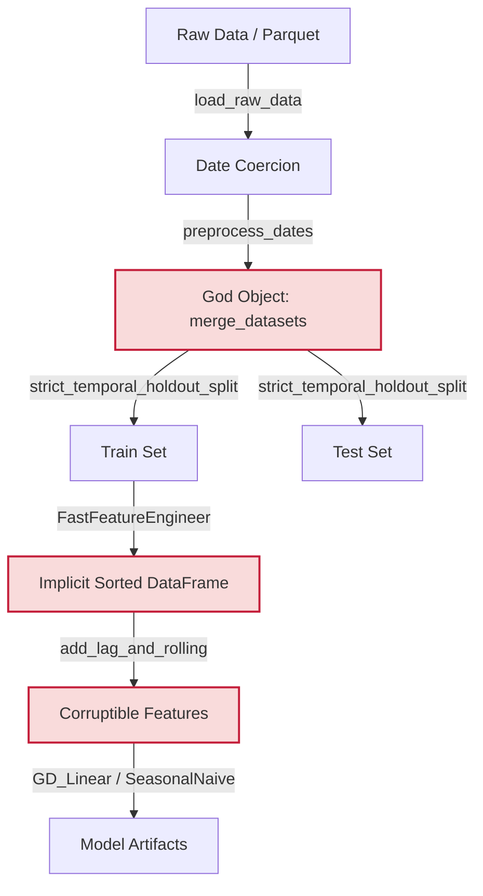
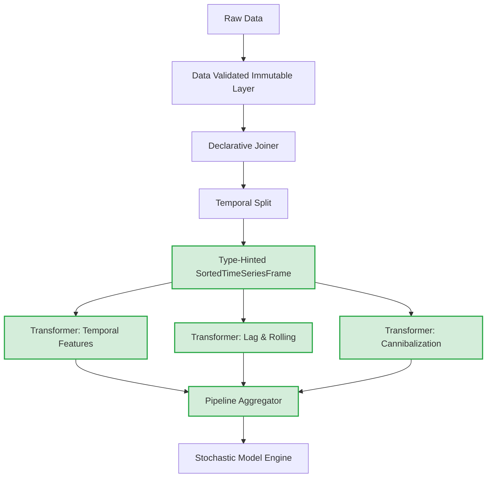

# 01. System Topology and State Machine: A Zero-Trust Architectural Audit

## 1. The Execution DAG: Mapping the Critical Path

The Retail-IQ system operates on a rigid, mostly linear Directed Acyclic Graph (DAG) for data ingestion, transformation, and model training. The execution flows from raw data to serialized artifacts, primarily orchestrated via the `FastFeatureEngineer` class and standalone preprocessing functions.

### The Standard State Flow

1.  **Ingestion (`load_raw_data`)**: Reads from fast Parquet paths (`PARQUET_DATA_DIR`) or falls back to CSVs (`RAW_DATA_DIR`). [Source: `src/retail_iq/preprocessing.py:L18`]
2.  **Date Coercion (`preprocess_dates`)**: Casts heterogenous date strings to `datetime64[ns]`. [Source: `src/retail_iq/preprocessing.py:L56`]
3.  **Global Merge (`merge_datasets`)**: Left-joins store metadata, cleaned oil prices, and transactions onto the main training frame. Flag national holidays. **Critically: Sorts the frame by `['store_nbr', 'family', 'date']`**. [Source: `src/retail_iq/preprocessing.py:L84`]
4.  **Temporal Split (`strict_temporal_holdout_split`)**: Slices the unified DAG chronologically to prevent future-peeking. [Source: `src/retail_iq/preprocessing.py:L148`]
5.  **Feature Engineering (`FastFeatureEngineer`)**: A fluent builder pipeline applying rolling statistics, lag features, and domain-specific proxies (like cannibalization). [Source: `src/retail_iq/features.py:L26`]
6.  **Model Fitting (`GD_Linear` / `SeasonalNaive`)**: Execution of training loops (JAX-accelerated or pure NumPy). [Source: `src/retail_iq/models.py:L36`]

---

## 2. Forensic Critique & System Design Principle Violations

A Zero-Trust reconstruction demands that we look past the surface-level "It runs fast" to the structural guarantees of the code. Evaluating this architecture against core Software Engineering principles reveals significant fragility.

### Violation 1: The "Implicit State" Anti-Pattern (PoLA Violation)
The `FastFeatureEngineer` proudly states in its docstring:
> *"self.df is sorted by [store_nbr, family, date] exactly ONCE in __init__. No add_* method may re-sort. All shift/rolling ops depend on this invariant."* [Source: `src/retail_iq/features.py:L8`]

**Why this is dangerous:**
This violates the **Principle of Least Astonishment (PoLA)** and strong cohesion. The methods (e.g., `add_lag_and_rolling`) implicitly trust that the object's state (`self.df`) has not been mutated externally or resorted by another developer hacking a new `add_` method. It creates a temporally coupled system where the *correctness* of the output depends on a silent, un-enforced memory arrangement. If an engineer adds `df.sort_values('date')` in `add_temporal_features`, all downstream lag features become silently, mathematically corrupted without throwing a Python error.

### Violation 2: God Object & Cohesion Loss (SRP Violation)
The `merge_datasets` function handles I/O merging, missing value imputation (ffill on transactions), logic flagging (national holidays), and data sorting. [Source: `src/retail_iq/preprocessing.py:L84`]
This violates the **Single Responsibility Principle (SRP)**. If the logic for what constitutes an active holiday changes, you must modify the core merge function, risking the stability of the entire dataframe construct.

### Violation 3: The "Tightly Coupled" Pipeline (LoD Violation)
The `FastFeatureEngineer` takes raw dataframes (`df`, `transactions`, `oil_price`, etc.) in its constructor, but methods like `add_macroeconomic_features` execute deep, hardcoded merges directly inside the class. [Source: `src/retail_iq/features.py:L161`]
This violates the **Law of Demeter (LoD)** and loose coupling. The feature engineer knows too much about the structure and existence of specific external datasets. If we swap out oil prices for a broader "commodity index", we have to gut the Feature Engineer class.

---

## 3. Sovereign Extension: The Robust Topology

To move from "fragile script" to "Top 0.000001% Enterprise System", the architecture must enforce its constraints programmatically, not via docstrings.

### The Target Architecture
We shift from an implicit state machine to a **Declarative Computation Graph**.

1.  **Immutability**: Dataframes should be treated as immutable within the feature generation pipeline.
2.  **Explicit Ordering Guarantees**: Instead of relying on a global sort in `__init__`, time-series operations (like `.shift()` and `.rolling()`) should explicitly enforce their required groupings and orderings via modern Pandas paradigms (e.g., passing the sort key directly into the groupby, or validating the index).
3.  **Modular Feature Extractors**: `FastFeatureEngineer` should be broken down into composable, independent feature transformers that implement a common interface (e.g., `fit_transform`), adhering to the Open-Closed Principle (OCP).

### Step-by-Step Actionable Insights

*   **Insight 1 (Immediate Fix): Enforce the Sort Invariant.** Add a fast `pd.Index.is_monotonic_increasing` check at the beginning of critical lag methods in `FastFeatureEngineer` to explicitly throw an error if the data has been mutated out of order. This costs O(N) but saves millions in silent forecasting errors.
*   **Insight 2 (Architectural Pivot): Isolate I/O from Logic.** Extract the holiday filtering logic out of `merge_datasets` into a dedicated `HolidayEncoder` module.
*   **Insight 3 (Resilience via Type Hinting):** Currently, features pass naked DataFrames. Wrap the core DataFrame in a custom class (e.g., `SortedTimeSeriesFrame`) that statically enforces the `[store_nbr, family, date]` sorting invariant upon instantiation, making the implicit contract explicit to the type checker.