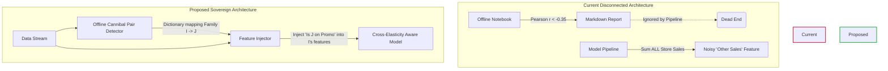

# 04. Cannibalization and Lift Mastery: Unmasking the Proxy

## 1. Intuition: Lift vs. Cannibalization

In retail math, promotions are double-edged swords.
*   **Promotional Lift** is the positive delta in sales volume generated directly by a promotion, relative to an un-promoted baseline. If you normally sell 100 boxes of cereal, and a 20% discount moves 150 boxes, your absolute lift is 50 boxes (a 50% relative lift).
*   **Cannibalization** is the negative delta in sales volume suffered by *adjacent* products because of that promotion. If your 20% discount on "Brand A" cereal caused "Brand B" cereal sales to drop from 100 to 70, the net category lift is only +20 boxes. The 30 boxes of "Brand B" were cannibalized.

## 2. Implementation: The Dual-Track Detection

Retail-IQ implements cannibalization detection in two vastly different ways, revealing a split between "Analysis" and "System Logic".

### The Analytical Script (`notebooks/cannibalization.ipynb`)
The notebook runs an offline statistical analysis. It calculates a 28-day rolling mean to detrend the sales (`sales_resid`), then isolates days where a product was on promotion. It computes the Pearson correlation matrix of these residual sales across different families within the same store.
```python
# From notebooks/cannibalization.ipynb
df_s['sales_resid'] = df_s['sales'] - df_s.groupby('family')['sales'].transform(
    lambda x: x.shift(1).rolling(28, min_periods=1).mean()
)
```
[Source: `notebooks/cannibalization.ipynb:22`]
If the correlation between Family I and Family J is strongly negative (e.g., $r < -0.35$), it flags them as a "Cannibal Pair".

### The Feature Pipeline (`src/retail_iq/features.py`)
However, the model pipeline does *not* use these correlation pairs. Instead, it creates a blunt proxy feature:
```python
# From src/retail_iq/features.py
self.df["other_family_sales"] = self.df["store_total_sales"] - self.df["sales"]
self.df["other_family_sales_lag_7d"] = (
    self.df.groupby(_SORT_COLS[:2])["other_family_sales"].shift(7)
)
```
[Source: `src/retail_iq/features.py:228`]
It simply aggregates *all* other sales in the store and lags it by 7 days.

## 3. Forensic Critique: The Disconnect and The Blurring Effect

There is a massive structural gap between the insights generated in the report and the mathematical reality of the model.

### Flaw 1: The Blunt Proxy (Systematic Blurring)
The feature `other_family_sales_lag_7d` is fundamentally flawed as a cannibalization signal. Cannibalization is highly specific (e.g., "Dairy" cannibalizes "Dairy Alternates"). By summing *all* other families in the store (including automotive, beauty, and produce), the signal is washed out by massive, uncorrelated noise. The model receives a feature that represents "General Store Traffic", not "Cannibalistic Pressure".

### Flaw 2: Temporal Misalignment
The proxy feature is lagged by 7 days (`other_family_sales_lag_7d`). Cannibalization is an *instantaneous* effect (or forward-looking effect). If I buy cheap cheese *today*, I don't buy expensive cheese *today*. Lagging the other families' sales by 7 days assumes that last week's general store traffic cannibalizes this week's specific family sales, which makes zero economic sense.

### Flaw 3: The Ignored Report
The notebook generates `cannibalization_report.md` detailing specific cannibal pairs (e.g., $r < -0.35$). But the production pipeline ignores this report entirely. The insights are printed, but never parameterized into the DAG.

## 4. Sovereign Extension: Integrating the Physics



We must unify the analytical detection with the predictive model. The model needs to be "aware" of specific, localized cannibalization vectors.

### Step-by-Step Actionable Insights

*   **Insight 1 (Cross-Elasticity Feature Engineering):** Ditch the blunt `other_family_sales_lag_7d`. Instead, the pipeline should ingest the `cannibal_pairs` output. For every target family $I$, identify its specific cannibal pair $J$. Create a feature: `onpromotion_family_J_lag_0d` (or lag corresponding to the prediction horizon). The model must know if its *enemy* is on sale right now.
*   **Insight 2 (Hierarchical Baseline Modeling):** The lift calculation in the notebook uses a naive 28-day rolling mean as a baseline. This fails to account for seasonality or trend. The true baseline should be the prediction of the `SeasonalNaive` model (or a secondary LightGBM model trained *without* promotional features). Lift is then defined strictly as actual sales minus baseline sales.
*   **Insight 3 (Promotion Intensity):** Replace the raw `onpromotion` count with a relative intensity metric: `onpromotion_ratio = onpromotion / total_SKUs_in_family`. This normalizes the promotional pressure across families of vastly different sizes.