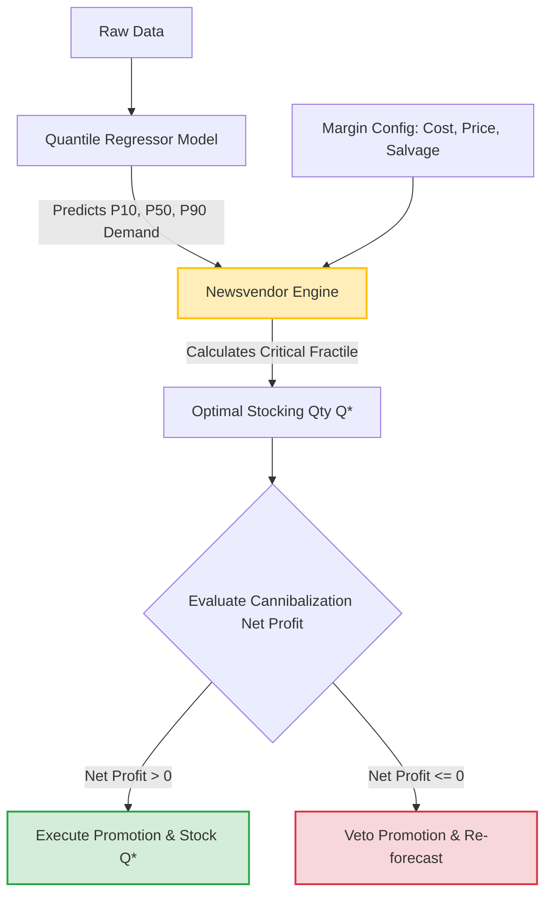

# 05. Prescriptive Profit Optimization: Architecting the Margin Engine

## 1. Intuition: Beyond Descriptive Analytics

A standard Data Scientist builds a model that says: "Tomorrow, Store 44 will sell 300 units of Family A." This is *Descriptive* (or Predictive).
A Sovereign Decision Scientist builds a system that says: "Given that Store 44 is predicted to sell 300 units of Family A, we should stock exactly 312 units to maximize expected net profit, accounting for a 5% risk of cannibalizing Family B." This is *Prescriptive*.

The ultimate goal of retail forecasting is not to minimize an academic loss metric (like RMSLE), but to solve the **Newsvendor Problem** at scale.

## 2. Implementation: The Missing Link

Currently, the Retail-IQ repository ends its DAG at prediction and evaluation (`src/retail_iq/evaluation.py`). It calculates metrics (`RMSLE`, `MAPE`) but stops before assigning a dollar value to its outputs. The system lacks the translation layer between predictions and inventory/pricing decisions.

## 3. Forensic Critique: The Cost of Inaction

By stopping at the prediction phase, the system implicitly assumes that:
1. Every item has the same profit margin.
2. The cost of overstocking equals the cost of understocking.
3. Selling a promoted item is purely beneficial, ignoring the margin destruction of cannibalization.

These assumptions are mathematically false and financially disastrous.

## 4. Sovereign Extension: The Prescriptive Framework

We must architect a generalized mathematical framework that transforms predictions into actionable, profit-maximizing decisions.

### Step 1: Define the Margin Parameters
For any item $i$, define:
*   $P_i$: Selling price.
*   $C_i$: Cost of goods sold (COGS).
*   $S_i$: Salvage value (if unsold, e.g., discount bin or scrap).
*   $M_i$: Unit margin ($P_i - C_i$).

### Step 2: The Expected Profit Function
The decision variable is $Q$ (the quantity to stock). The random variable is $D$ (the true demand, which our model predicts as a distribution $\hat{D}$).

The profit $\Pi$ for a given $Q$ and $D$ is:
$\Pi(Q, D) = P \cdot \min(D, Q) + S \cdot \max(Q - D, 0) - C \cdot Q$

We want to find $Q^*$ that maximizes the Expected Profit $E[\Pi(Q, D)]$.
Using the classic Newsvendor ratio (Critical Fractile), the optimal service level is:
$CR = \frac{P - C}{P - S}$

Instead of predicting a single point estimate (the mean), our model must output a cumulative distribution function (CDF) of demand, $F_D(x)$. We stock $Q^*$ such that $F_D(Q^*) = CR$.

### Step 3: Accounting for Cannibalization
If placing item $A$ on promotion (reducing $P_A$ to $P'_A$) causes a drop in demand for item $B$, the true profit equation must couple them. Let $\Delta D_B$ be the cannibalized volume.
The Net Promotional Profit is:
$\text{Net Profit} = (P'_A - C_A) \cdot D'_A - (P_A - C_A) \cdot D_A - (P_B - C_B) \cdot |\Delta D_B|$

If this Net Profit is $\leq 0$, the promotion is a destructive action, regardless of how much absolute lift item $A$ receives.

### Step-by-Step Actionable Insights

*   **Insight 1 (Probabilistic Forecasting):** Transition the model output from point estimates (e.g., `predict(X) -> 300`) to probabilistic forecasts. Use Quantile Regression (e.g., LightGBM with `objective='quantile'`) to predict the 10th, 50th, and 90th percentiles of demand.
*   **Insight 2 (The Profit Optimizer Module):** Create a new module `src/retail_iq/optimization.py`. This module takes the predicted quantiles and the margin configuration (`config.py`) to calculate the optimal stocking quantity $Q^*$ that maximizes expected profit.
*   **Insight 3 (The Promotion Veto):** Implement a circuit-breaker function. If the predicted cannibalization effect (`- Margin_B * Delta_D_B`) exceeds the predicted promotional lift profit, the system flags the promotion as "Margin Destructive" and recommends cancellation.