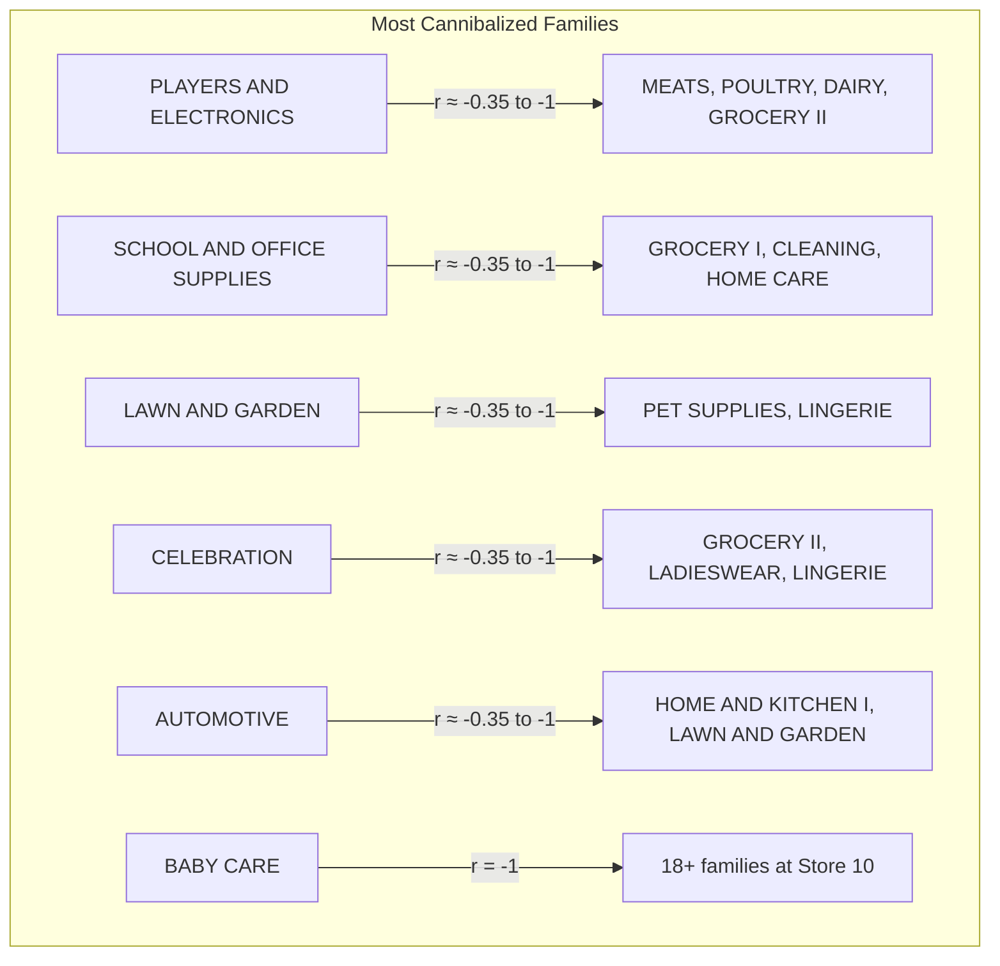

# 04 — Cannibalization & Promotional Lift

## Mental Model

**Cannibalization** = When promoting Product A suppresses Sales of Product B (same store, same day). The customer has a fixed budget (time + money). Promoted items draw traffic away from non-promoted items.

**Promotional Lift** = The incremental sales a product gains due to promotion, above its "organic" (non-promoted) baseline.

**Delta** = Lift (incremental promo gain) − Organic Growth (what would have happened anyway). Net lift must exceed cannibalization cost to justify the promo.

## Detection Algorithm

```python
# cannibalization.ipynb (notebooks cell 1f660312)
def find_cannibal_pairs(df, promo_threshold=0, corr_threshold=-0.35):
    # Step 1: Detrend — remove 28d rolling mean baseline
    df_s['sales_resid'] = df_s['sales'] - df_s.groupby('family')['sales'].transform(
        lambda x: x.shift(1).rolling(28, min_periods=1).mean()
    )
    # Residuals = actual − expected. Positive = promo drove it. Negative = cannibalized.

    # Step 2: Filter to promotion periods only
    promo_mask = df_s['onpromotion'] > promo_threshold

    # Step 3: Pivot to date × family matrix of residuals
    df_promo = df_s[promo_mask].pivot_table(index='date', columns='family', values='sales_resid')
    corr = df_promo.corr()  # Pearson correlation

    # Step 4: Find strong negative correlations
    # r < -0.35 = when one family sells above baseline, another sells below
```

**Why residualize?** Raw sales correlation would be dominated by baseline levels (GROCERY I >> LINGERIE). Detrending isolates the promo-driven variance.

**Why onpromotion > 0 filter?** Cannibalization only matters during promotions. Off-promotion, families have stable differentiated demand.

**Why r < −0.35 threshold?** Empirically chosen. r < 0 = negative correlation. r < −0.35 = moderate-to-strong negative relationship. r = −1 = perfect mirror (when A sells above baseline, B sells exactly below baseline).

## Results Summary (1054 Pairs Across 54 Stores)

Top patterns from `outputs/reports/cannibalization_report.md`:



**Notable pairs** (r = −1, perfect cannibalization):
- Store 1: AUTOMOTIVE ↔ HOME AND KITCHEN I
- Store 1: CELEBRATION ↔ LINGERIE
- Store 1: LAWN AND GARDEN ↔ SCHOOL AND OFFICE SUPPLIES
- Store 10: BABY CARE ↔ all of BEVERAGES, GROCERY I, HOME AND KITCHEN I, II, LADIESWEAR, etc.

## Promotional Lift Computation

```python
# cannibalization.ipynb
def compute_promo_lift(df, window_pre=28):
    df['baseline'] = df.groupby(['store_nbr', 'family'])['sales'].transform(
        lambda x: x.shift(1).rolling(window_pre, min_periods=1).mean()
    )
    df['lift'] = (df['sales'] - df['baseline']) / df['baseline'].replace(0, np.nan)
    promo_events = df[df['onpromotion'] > 0][['store_nbr','family','date','sales','baseline','lift']].dropna()
    return promo_events
```

- **Baseline** = 28-day rolling mean before the promo period (shifted by 1 to prevent leakage).
- **Lift** = (Actual − Baseline) / Baseline. Positive lift = promo drove extra sales. Negative lift = promo cannibalized own baseline sales.
- **Counterfactual** = what sales would have been without promotion.

## Quantifying: Lift vs Organic Growth

```python
# Mathematical decomposition
Net_Lift = (Actual_Promo - Baseline_NonPromo) - Organic_Growth

# Where:
# Actual_Promo      = sales during promotion period
# Baseline_NonPromo = counterfactual (28d rolling mean)
# Organic_Growth    = trend component (e.g., same-period-last-year)

# Cannibalization Cost = sum over cannibal pairs:
#   (Suppressed_Sales_B / Baseline_B) × Price_B × Margin_B
```

## Mitigation Strategies (From Codebase)

```python
# features.py:L258-L285 — Cannibalization feature
# Cross-family sales as feature: "other family sales" lag signals
fe.add_cannibalization_features()
# Adds: other_family_sales_lag_7d

# Strategy 1: Model-aware forecasting
# When PLAYERS AND ELECTRONICS is on promotion, the model learns
# to reduce forecast for SCHOOL AND OFFICE SUPPLIES via other_family_sales_lag_7d.

# Strategy 2: Inventory pre-positioning
# Before a AUTOMOTIVE promo, pre-position HOME AND KITCHEN I stock
# to capture redirected demand.

# Strategy 3: Avoid simultaneous promotion of cannibal pairs
# Build a conflict matrix from find_cannibal_pairs() output.
# When scheduling promotions, never activate both members of a |r| > 0.7 pair.
```

## Line-Reference Table

| Component | File | Lines |
|-----------|------|-------|
| `find_cannibal_pairs()` | notebooks/cannibalization.ipynb | cell 1f660312 |
| `compute_promo_lift()` | notebooks/cannibalization.ipynb | cell 1f660312 |
| `add_cannibalization_features()` | features.py | L258-L285 |
| `other_family_sales_lag_7d` | features.py | L280-L282 |
| Cannibalization report | outputs/reports/cannibalization_report.md | L1-L1054 |

## Pitfalls

1. **Correlation ≠ causation**: Two families may be negatively correlated because both are suppressed by the same third factor (e.g., store traffic), not because they cannibalize each other.
2. **Threshold selection**: −0.35 is empirically chosen. Too strict (e.g., −0.8) → few pairs, too loose → noise pairs.
3. **Store-level vs aggregate**: Cannibalization patterns vary by store type (A-E). Aggregating across stores dilutes the signal. The code correctly computes per-store.
4. **Lag selection**: 7d lag for `other_family_sales_lag_7d` is a proxy. True cannibalization may manifest within the same day.
5. **No p-value — SPEC violation**: `SPEC.md §B` requires `≥3 cannibal pairs with r, p-value`. The report at `outputs/reports/cannibalization_report.md` outputs only `r`. Missing significance test. Below is the fix:

```python
from scipy import stats
import numpy as np

def find_cannibal_pairs_with_pvalue(df, promo_threshold=0, corr_threshold=-0.35):
    stores = df['store_nbr'].unique()
    pairs = []
    for s in stores:
        df_s = df[df['store_nbr'] == s].copy()
        df_s['sales_resid'] = df_s.groupby('family')['sales'].transform(
            lambda x: x.shift(1).rolling(28, min_periods=1).mean()
        )
        promo_mask = df_s['onpromotion'] > promo_threshold
        df_promo = df_s[promo_mask].pivot_table(index='date', columns='family', values='sales_resid')
        corr = df_promo.corr()
        n = len(df_promo)  # sample size

        for i, fam_i in enumerate(corr.columns):
            for fam_j in corr.columns[i+1:]:
                r = corr.loc[fam_i, fam_j]
                if r < corr_threshold:
                    # Transform r to t-statistic: t = r*sqrt(n-2)/sqrt(1-r^2)
                    t_stat = r * np.sqrt(n - 2) / np.sqrt(1 - r**2)
                    p_value = 2 * stats.t.sf(np.abs(t_stat), df=n-2)
                    pairs.append({'store': s, 'family_i': fam_i, 'family_j': fam_j, 'r': r, 'p_value': p_value})
    return pd.DataFrame(pairs)
```

## Holiday Transferred Flag — Critical Bug

> **Bug — Transferred holidays filtered OUT when they carry the strongest signal.**

Code at `preprocessing.py:L141`:
```python
active_holidays = holidays[holidays["transferred"] == False]  # 排除 transferred
national_dates = set(active_holidays.loc[active_holidays["locale"] == "National", "date"])
df["is_national_holiday"] = df["date"].isin(national_dates).astype(np.int8)
```

And at `features.py:L104`:
```python
active = self.holidays[self.holidays["transferred"] == False]
```

**Problem:**
- `transferred=True` = Ecuador 挪假效應（holiday 從原日期挪到工作日）
- Example: Christmas (Dec 25) falls on Saturday → Dec 24 (Friday) becomes the observed holiday, Dec 25 becomes a normal work day
- **The transferred day shows the most anomalous sales pattern**, not the original date
- Filtering out transferred = losing the挪假 signal entirely

**Correct implementation:**
```python
# Two separate features:
df["is_national_holiday"] = df["date"].isin(national_dates).astype(np.int8)
df["is_transferred_holiday"] = df["date"].isin(transferred_dates).astype(np.int8)
# Or: compute "actual holiday observed on this date"
```
