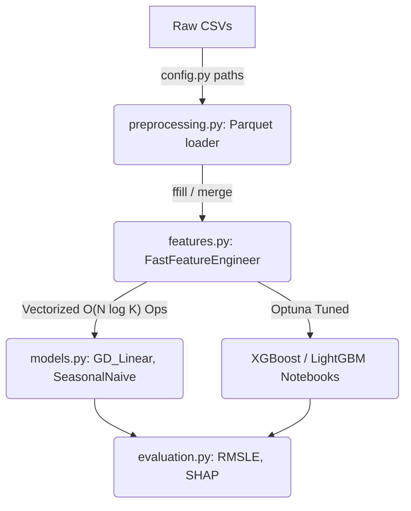

# Retail-IQ: Multi-Family Demand Forecasting System

[](https://www.python.org/downloads/release/python-3100/)
[](#implementation-phases)
[](https://opensource.org/licenses/MIT)

## Overview

Retail chains face a dual failure mode: overstocking perishable goods creates waste, while understocking drives revenue leakage. Existing tools often apply univariate models that ignore critical retail dynamics.

**Retail-IQ** is a multi-family panel regression forecasting system built to tackle this challenge. It analyzes daily sales across 54 stores and 33 product families using the Corporación Favorita dataset. Beyond mere forecasting, the system quantifies **promotional lift** and detects **cannibalization** across adjacent SKUs.

### Key Capabilities
- **Robust Pipeline**: Highly optimized feature engineering using vectorized operations (O(N log K) time complexity for complex mappings).
- **Dual Tracking**: Models continuous volume while evaluating promotional efficacy.
- **From-Scratch Engineering**: Custom JAX-accelerated Gradient Descent Linear Regression baseline alongside standard advanced methods.
- **Scalable State**: Designed using immutable, pure-function pipelines tracking strict zero-retention invariant strategies.

---

## System Architecture

Retail-IQ is designed as a strict Directed Acyclic Graph (DAG) pipeline. Every stage is a pure function.



*See [`src/retail_iq/config.py`](src/retail_iq/config.py) for data path strictness and [`Learn_minmax_insights/01_System_Architecture.md`](Learn_minmax_insights/01_System_Architecture.md) for architectural invariants.*

---

## ⚡ Quick Start Tutorial

To execute the forecasting pipeline using our strictly encapsulated modules, follow these steps.

### 1. Environment Setup

We highly recommend using `uv` for lightning-fast package management.

```bash
uv venv
source .venv/bin/activate
uv pip install -e .
```

### 2. Loading & Preprocessing Data

Data loading heavily favors Parquet files for significant speed boosts.

```python
from retail_iq.preprocessing import load_raw_data, preprocess_dates, merge_datasets

# 1. Load data
train, test, stores, oil, holidays, transactions = load_raw_data()

# 2. Date conversion
train, test, oil, holidays, transactions = preprocess_dates([train, test, oil, holidays, transactions])

# 3. Merge panel
df_merged = merge_datasets(train, stores, oil, holidays, transactions)
```
*[Explore preprocessing.py](src/retail_iq/preprocessing.py)*

### 3. Feature Engineering

Use the fluent `FastFeatureEngineer` API. **Rule of thumb**: Never call `.copy()` inside chained methods, and data is sorted purely once during initialization to avoid leakages.

```python
from retail_iq.features import FastFeatureEngineer

ffe = FastFeatureEngineer(df_merged, transactions, oil, holidays, stores)

df_features = (ffe
    .add_temporal_features()
    .add_lag_and_rolling(lags=[1, 7, 14, 365], windows=[7, 14, 28])
    .add_onpromotion_features()
    .add_macroeconomic_features()
    .transform()
)
```
*[Explore features.py](src/retail_iq/features.py)*

### 4. Baseline Modeling (From Scratch)

Run our custom JAX-compiled Gradient Descent Linear Regressor.

```python
from retail_iq.models import GD_Linear
import numpy as np

# Apply target transformation
y_log = np.log1p(y_train)

# Initialize and fit
model = GD_Linear(lr=0.001, iterations=1000, l2=0.01)
model.fit(X_train, y_log)

# Predict and inverse transform
preds = np.expm1(model.predict(X_test))
```
*[Explore models.py](src/retail_iq/models.py)*

---

## Project Structure

```text
Retail-IQ/
├── data/
│   ├── raw/                # Unmodified input CSVs
│   └── processed/          # Cleaned and featured datasets (Parquet)
├── docs/                   # Full academic and technical documentation
├── notebooks/              # Strictly driver-notebooks for execution
├── src/
│   └── retail_iq/
│       ├── config.py       # Centralized strict path constants
│       ├── preprocessing.py# Pure functional data cleaners
│       ├── features.py     # FastFeatureEngineer fluent pipeline
│       ├── models.py       # Custom baselines (GD_Linear, Naive)
│       ├── evaluation.py   # Validation and SHAP utility suite
│       └── perf_utils.py   # Profiling utilities
└── pyproject.toml          # Project configuration
```

---

## Implementation Phases

- [x] **Phase 1:** Project setup & repository init
- [x] **Phase 2:** Data Ingestion & Validation (Preprocessing)
- [x] **Phase 3:** Exploratory Data Analysis (EDA)
- [x] **Phase 4:** Vectorized Feature Engineering
- [x] **Phase 5:** Baseline Modeling (GD Linear / Seasonal Naive)
- [x] **Phase 6:** Advanced Modeling + Optuna Tuning
- [x] **Phase 7:** Evaluation + SHAP Analysis
- [x] **Phase 8:** Cannibalization & Lift Analysis
- [ ] **Phase 9:** Finalization & Report Generation *(Current Target)*

---

## 🚨 Known Issues & Future Directions

For collaborators entering the repository, there are critical architectural and logical blindspots to address:

### Critical Known Issues
1. **Memory Blowup:** Current `add_lag_and_rolling()` operations create intermediate dataframe state replications. Investigating zero-copy methodologies is paramount.
2. **Lag Feature Leakage Risk:** Any un-shifted rolling operations leak the current period. Strict guardrails must be preserved within the `FastFeatureEngineer` pipeline to prevent accidental leakage.
3. **Oil Price Spurious Correlation:** Because the oil market closes on weekends, `ffill` pushes Friday prices to Saturday/Sunday. Given oil is a macro proxy, this introduces a lagged correlation risk.

### Future Optimization Directions
- **Two-Stage Zero-Inflation Modeling:** Approximately 40-60% of our rows contain structural zero-sales. All current models (GD, XGB, LGBM) output continuous probabilities and systematically under-predict zero periods. **Action item:** Transition to a two-stage approach: A classifier predicting `P(sales=0)` followed by a regressor predicting `E(sales|sales>0)`.
- **Dtype Bloat:** Memory compression pipeline needs to aggressively transition generic float64/int64 matrices into float32/int16 categories upon loading.

---

## Core Team

- Ayesha Khalid (23L-0667)
- Uma E Rubab (23L-0928)
- Sheraz Malik (23L-0572)
